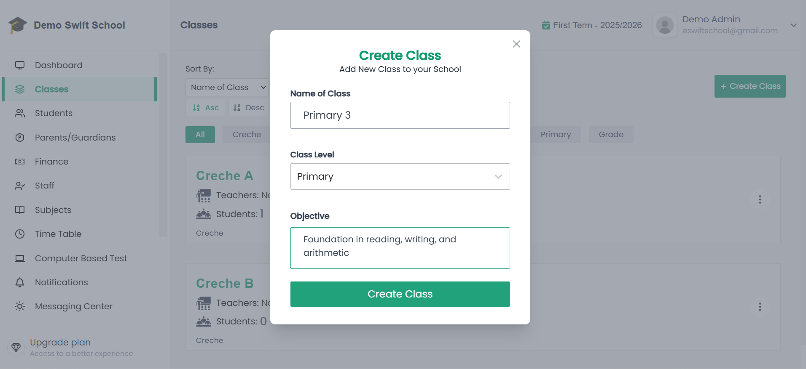

# Activate Fees

A **Class** in your school management system is simply your **physical classroom represented digitally**.  
It is the space where you can:  

- Mark student **attendance**  
- Record and manage **examination assessments**  
- Conduct all other **administrative tasks** related to that class  

In short, every class you have in real life **in your school** should also exist in the system so you can manage it seamlessly.

---

## Steps to Create a Class

1. **Log in** to your **Admin Dashboard**.  
2. From the side menu, click **Classes**.  
   - This will open the **Classes page**, where you can see a list of all existing classes (if any).  
3. On the top-right (or above the list), click the **Create Class** button.  
   - A **modal form** will pop up.  
4. Fill in the form with the following details:  
   - **Class Name** → The name of the class (e.g., *Primary 3*, *Grade 5*, *SS1A*).  
   - **Class Level** → This represents the stage of learning (e.g., *Primary*, *Junior Secondary*, *Senior Secondary*).  
     > 📌 Class Levels are very important because **subjects in your school are grouped by class level**.  
     > For example:  
     > - *Primary Level* → Subjects like English, Mathematics, Basic Science  
     > - *Senior Secondary Level* → Subjects like Physics, Literature, Government  
     > You can add or remove subjects in your school, but they will always be organized by class level.  
     > Choosing the right **Class Level** ensures your class automatically gets the correct set of subjects.  
   - **Objective** *(Optional)* → A short note describing the purpose of the class (e.g., *Prepare students for transition to Junior Secondary*).  

📸 **Example of a New Class form being filled out:**  

  

5. Once you are done, click the **Create Class** button on the modal to submit.  

---

## Example

- **Class Name:** Primary 3  
- **Class Level:** Primary  
- **Objective:** Foundation in reading, writing, and arithmetic  

Another example:  

- **Class Name:** SS1  
- **Class Level:** Senior Secondary  
- **Objective:** Preparing students for WAEC & NECO examinations  

---

## Why Class Level Matters

Subjects in are grouped by **class levels**, so it’s important to choose the appropriate class level when creating a class. This ensures that each class is automatically linked to the correct collection of subjects.

👉 This is why it is important to always select the **appropriate class level** when creating a class.

---

🎉 You’ve successfully created a **Class** in your school!
