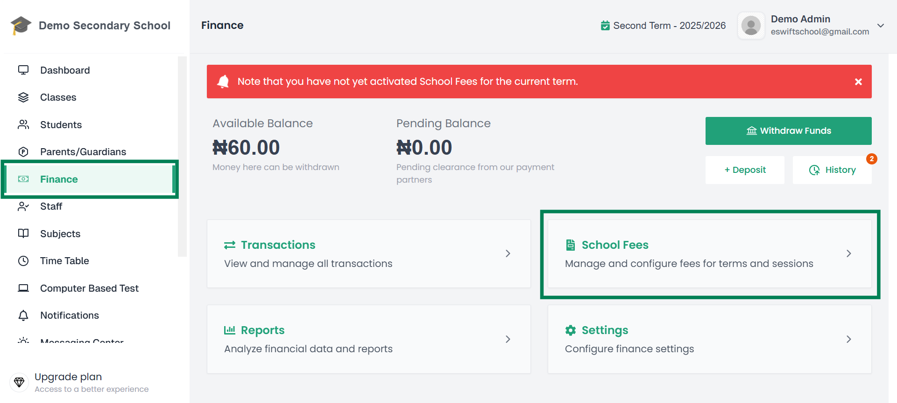
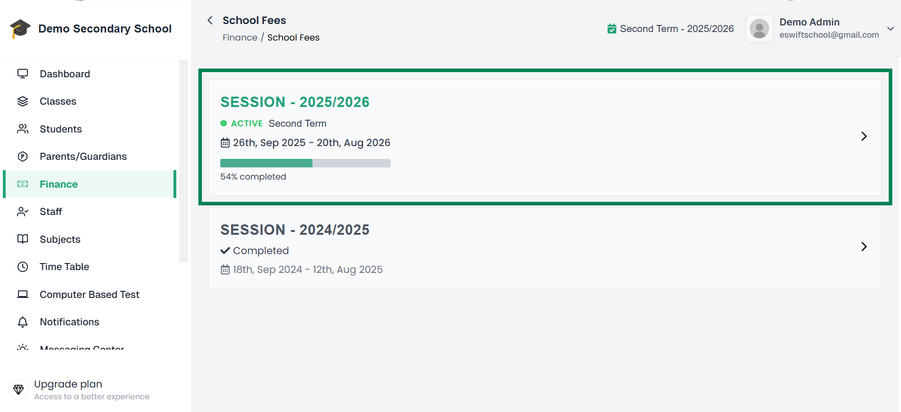
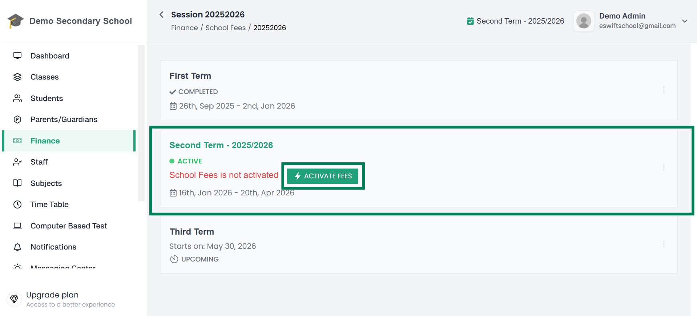

# Activate Fees

The **Activate Fees** feature allows you to make school fees available for a specific **academic session and term**.  

Once fees are activated:
- Students can **view their payable fees**
- Payments can be **processed and recorded**
- Financial tracking for that term becomes **active**

---

## Steps to Activate Fees

1. **Log in** to your **Admin Dashboard**.  

2. From the sidebar, click **Finance**.  
   - This will open the **Finance Management page**.  

3. On the Finance page, click **School Fees** from the list of options.  
   - This will take you to the **Sessions page**, where all academic sessions are listed.  

📌Finance Page:  
  
---

4. Click on the **current session** you want to activate fees for.  
   - You will now see a list of **terms** under that session.  

📌 List of Sessions:  
  
---
  

5. Locate the **current active term**.  
   - You will see an **Activate Fees** button next to it.  

📌 Term list with Activate Fees button visible:  
  
---

6. Click the **Activate Fees** button.  
   - A **confirmation popup** will appear.  

---

7. Click **Confirm and Activate Fees**.  
   - Fees will now be successfully activated for that term.  

📸 *Screenshot Placeholder: Success state or confirmation message*  

---

## Important Notes

- ✅ Ensure you are activating fees for the **correct session and term**  
- ⚠️ Once activated, fees become **available to students immediately**  
- 🔁 If changes are needed, you will have to **update fee structure of that class and then use the sync button to apply the changes**

---

## Example

- **Session:** 2025/2026  
- **Term:** First Term  
- **Action:** Activate Fees  

👉 After activation, fees will be applied to all students based on the fee structure of their respective classes. You can now use the system to manage fee collection.
---

🎉 You have successfully activated **School Fees** for the selected term!