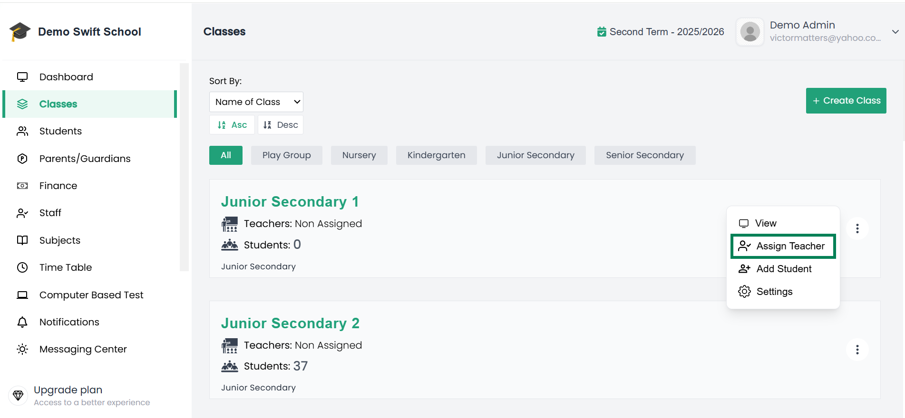
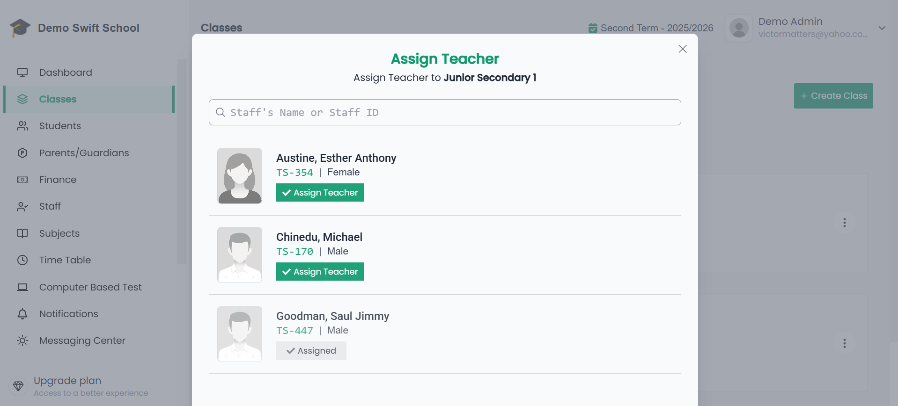
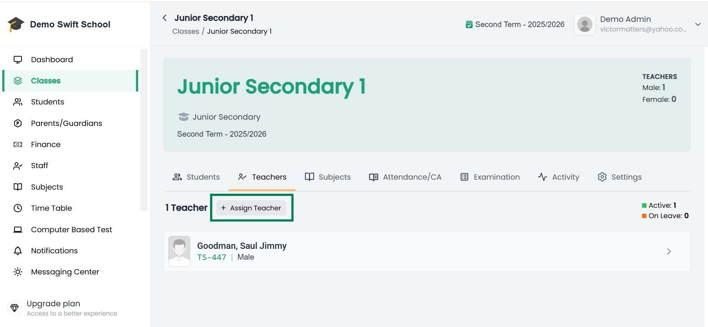

# 👨‍🏫 Add Staff to Class (Assign Teacher)

There are different ways to assign a staff member (teacher) to a class in the system.  

---

## 1. From the List of Classes  

1. From the side menu, click **Classes**.  
2. This will display the list of all classes in your school.  
3. On the right side of the class you want, click the **3 vertical dots** (More Options).  
4. From the menu, select **Assign Teacher**.  

📌 Example of Classes Page:  
  

5. A modal will pop up showing a list of available staff who are not yet assigned to this class.  
6. Next to each staff name, click **Assign** to add the teacher to that class.  

📌 Example of Assign Teacher Modal:  
  

---

## 2. From Inside a Class  

1. Open the class by clicking its name from the **Classes list**.  
2. Go to the **Staff** tab *(next to Students tab)*.  

📌 Example of Staff Tab:  
   

3. Click the **Assign Teacher** button.  
4. A modal will appear with a list of unassigned staff members.  
5. Click **Assign** next to each teacher you want to add.  

---

## ✅ Important Notes
- Only **academic staff** are shown in the assign list.  
- Staff registered as **non-academic** will **not** appear for assignment.  

---

🎉 Once assigned, the teacher will appear under the selected class and will have access to attendance, grading, examinations, and other classroom activities.
