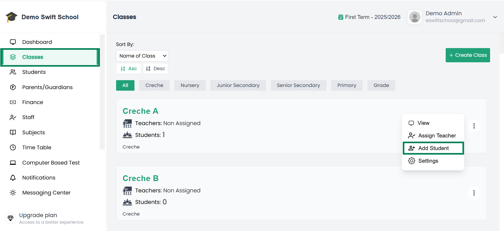
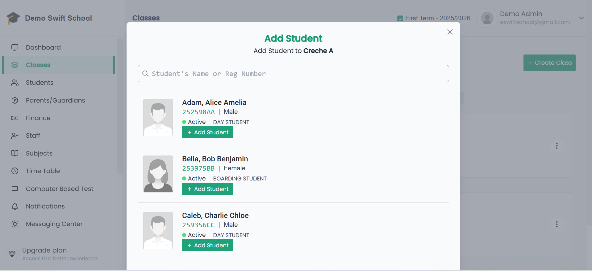
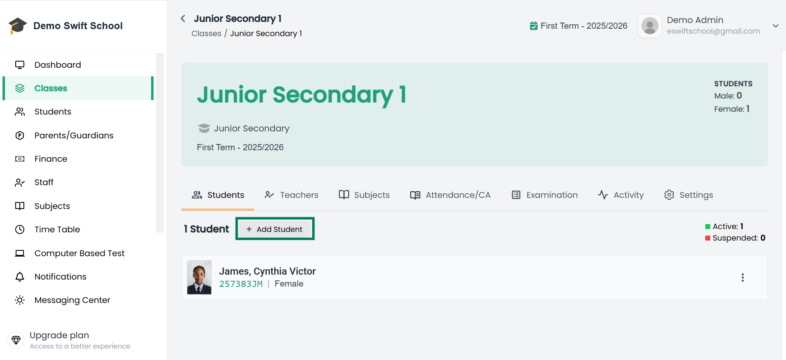

# Add Student to Class

There are several ways you can add a student to a class in the system:  

---

## 1. From the List of Classes

- From the side menu, click **Classes**.  
- This will open the list of all classes in your school.  
- On the right side of the class you want, click the **3 vertical dots** (More Options).  
- From the menu, select **Add Student**.  

  

- A modal will pop up showing a list of students who are not assigned to any class.  
- Next to each student’s name, you will see an **Add Student** button.  
- Click **Add Student** for each student you want to include in the class.  

   

---

## 2. From Inside a Class  

- Open the class by clicking its name from the **Classes list**.  
- Go to the **Students** tab *(usually the first tab)*.  

  

- Click the **Add Student** button.  
- A modal will appear with a list of unassigned students.  
- Click the **Add Student** button next to each student you want to assign to the class.  

---

🎉 Once added, the students will now appear under the selected class and can participate in attendance, assessments, examination and other class activities.
