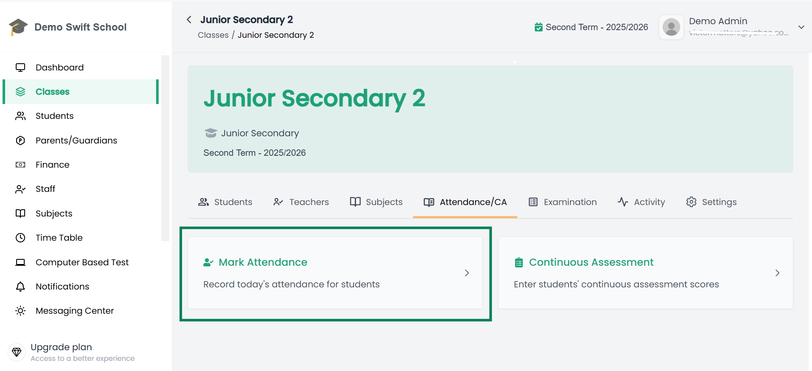
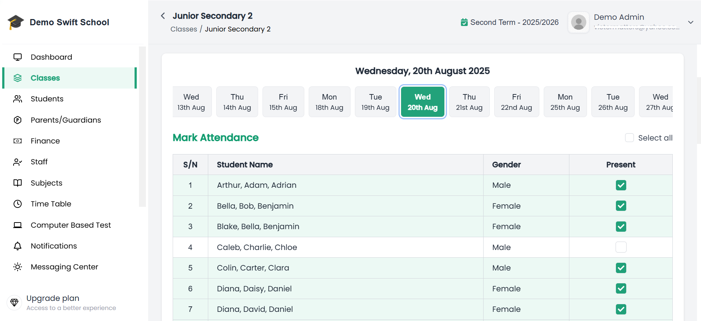

# 📋 Mark Class Attendance

Teachers can record student attendance for their classes directly in the system.  

---

## Steps to Mark Attendance  

1. From the side menu, click **Classes**.  

2. Select the class you want to mark attendance for on that day.  

3. When the class opens, go to the **Attendance/CA** tab.  

📌 Example of Attendance/CA Tab:  
  

4. Click on the **Mark Attendance** card.   

5. This will open the **Attendance Marking Page**.  

6. On the Attendance Marking Page:  
   - Check the boxes for students who are **present**.  
   - Leave unchecked for students who are **absent**.  

📌 Example of Attendance Marking Page:  
  

7. After selecting, click **Submit** to save the attendance.  

---

## ✅ Important Notes
- Attendance dates are automatically restricted to the **term start and end dates**.  
- For this reason, it is strongly advised to always set the **Session Calendar accurately**.  

---

🎉 Once submitted, the attendance record is saved and can be viewed or updated later as needed.
