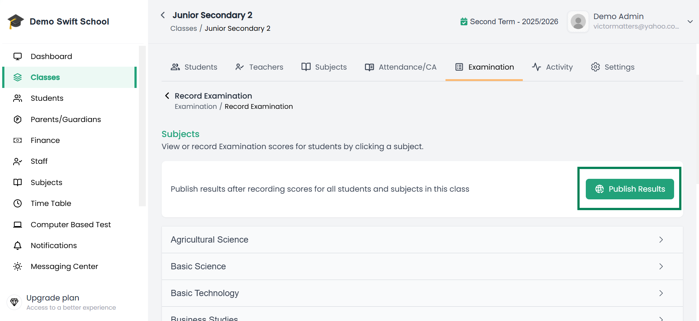
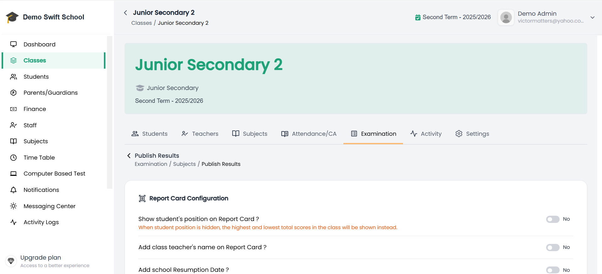

# 📢 Publish Results

By now, it is assumed that you have already:
- Recorded **Assessment and Examination Scores** → [How to Record Scores](/docs/admin/classes/record-examination-scores)

Publishing is the **final step**. Until results are published, they will not be visible to students, parents, or in the student’s academic records.

---

## Steps to Publish Results

1. Open the **class** where you have already recorded both **assessments** and **examination scores**.  
2. Go to the **Examination** tab.  
3. At the top of the subjects list, click the **Publish Result** button.  

📌 **Example of Publish Result Button:**  

4. You will be taken to the **Result Publication Page**, where you can customize how the report card should appear for this class.  

   Options include:  
   - ✅ Show student position (true/false)  
   - ✅ Add class teacher's name on Report Card 
   - ✅ Add school resumption date (true/false)  
   - ✅ Add next term's School Fees Amount (true/false)  
   - ✅ Add number of days school opened and number of days student was absent (true/false)  

   📌 **Example of Result Publication Page:**  
   

5. After setting report card preferences, scroll down to:  
   - **Rate each student on affective and psychomotor domains** (e.g., punctuality, attentiveness, teamwork).  
   - **Add Head Teacher/Principal’s Comments** for the overall term performance.  

6. Review all details carefully, then click **Publish Results**.  

7. Once published, results will be accessible in the **Academics** tab of each student’s profile, and in secondary views like the **Parents’ Dashboard**.  

---

## ✅ Important Notes

- You should only publish results after **both assessments and examination scores** have been recorded.  
- Published results are visible system-wide, so **double-check all entries** before publishing.  
- If an error is discovered after publishing, results may need to be **unpublished** (if your school’s settings allow) before corrections can be made.  
- Report card preferences (position, comments, domains, etc.) are specific to the selected class/publication cycle.  

---

## 🧭 Suggested Workflow

**Record Examination Scores → Result Preferences → Publish**  

> Keep this order to ensure all data appears correctly across student profiles and reports.
