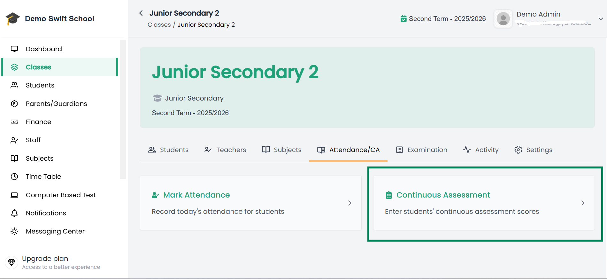
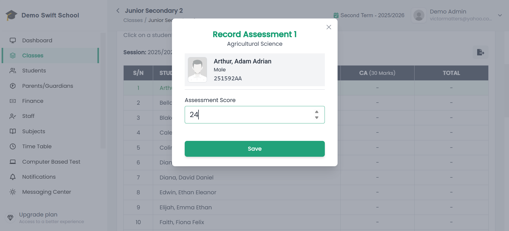

# 📝 Record Class Assessment  

Admin/Teachers can record **Continuous Assessment (CA)** for students in their classes directly in the system.  

---

## Steps to Record Class Assessment  

1. From the side menu, click **Classes**.  

2. This opens a page with your **list of classes**. Select the class you want to record assessment for.  

3. When the class opens, go to the **Attendance/CA** tab (CA stands for *Class Assessment*).  

4. Click on the **Continuous Assessment** card.  

📌 Example of Attendance/CA tab:  
  

5. This will show a list of **subjects available to the class**. Click on the subject you want to record assessment for.  

6. You will be taken to the **Assessment Recording Page** for that subject, where you will see a list of all students in the class.  

📌 Example of Assessment Recording Page:  
  

7. Click on a student’s row to record assessment for that student.  

---

## ✅ Important Notes  
- Assessments can be configured differently for each class. For example:  
  - **CA1 only**  
  - **CA1 & CA2**  
  - **CA1, CA2 & CA3**  
- The available assessment slots depend on your school’s configuration.  

📖 To learn more, see: [Configuring Grading System](/docs/admin/configuration/configuring-grading-system)

---
