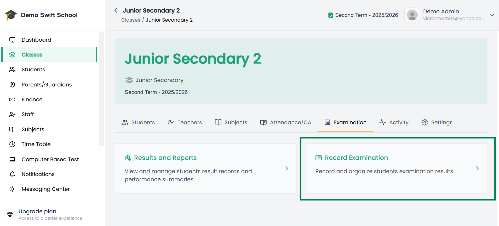
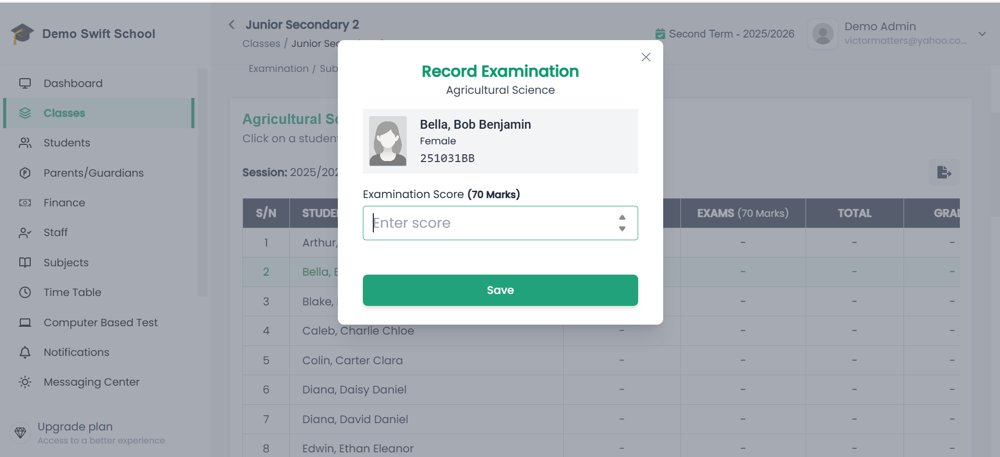

# 📝 Record Class Examination  

A student’s academic records for a selected session and term are only available if **examination results have been recorded and published** for that student.  

Admins (or teachers with the right permissions) can record **Examination Scores** for students in their classes directly in the system.  

---

## Steps to Record Class Examination Scores 

1. From the side menu, click **Classes**.  

2. This opens a page with your **list of classes**. Select the class you want to record examination scores for.  

3. When the class opens, go to the **Examination** tab.  

4. Click the **Record Examination** card.  

📌 **Example of Examination Tab:**   
  

5. A list of **subjects available for the class** will appear. Click on the subject you want to record assessments for.  

6. You will be taken to the **Examination Recording Page** for that subject. Here, you will see a list of all students in the class, along with any previously recorded assessment scores (if available).  

   - If no assessment scores have been recorded yet and you would like to learn how to record them, check out the [Assessment Guide](/docs/admin/classes/record-class-assessment).

📌 **Example of Examination Recording Page:**  
  

7. Click on a student’s row to enter their examination scores.  

8. After recording scores for all subjects and students in the class, review everything carefully.  

   - Once satisfied, click the **Publish Result** button (located above the subject list) and complete the publication process to make the results available.  

📌 **Example of Publish Result Button:**  
 

---

## ✅ Important Notes  

- Results must be published before they become accessible in the **Academics tab** of a student’s profile or in secondary locations such as the **Parents’ Dashboard**.  

📖 To learn more about publishing results, see: [Publishing Results](/docs/admin/classes/publishing-results)

---
