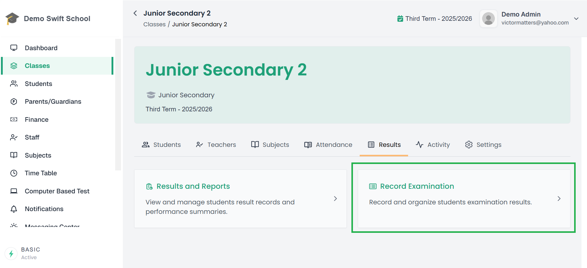
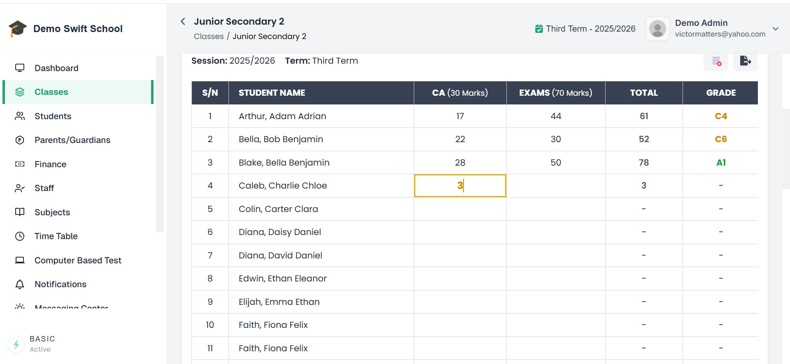

# 📝 Record Examination Scores  

A student’s academic records for a selected session and term are only available if **examination results have been recorded and published** for that student's class.  

Admins (or teachers with the right permissions) can record **Assessment and Examination Scores** for students directly in the system.  

---

## Steps to Record Examination/Assessment Scores 

1. From the side menu, click **Classes**.  

2. This opens a page with your **list of classes**. Select the class you want to record examination scores for.  

3. When the class opens, go to the **Results** tab.  

4. Click the **Record Examination** card.  

📌 **Example of Results Tab:**   
  

5. A list of **subjects available for the class** will appear. Click on the subject you want to record assessments for.  

6. You will be taken to the **Scores Capturing Page** for that subject. Here, you will see a list of all students in the class.  

📌 **Example of Scores Capturing Page:**  
  

7. Click on a cell to record or edit examination/assessment scores.  

8. After recording scores for all subjects and students in the class, review everything carefully.  

   - Once satisfied, click the **Publish Result** button (located above the subject list) and complete the publication process to make the results available.  

:::tip Note:

- **Teachers** will see **Submit Result** instead of **Publish Result**.  
  Submitted results are sent for review and **cannot be published directly by teachers**.

- **System Administrators / Authorized Approvers** will review submitted results.  
  Once approved, they can **Publish the results**, making them visible to students and parents.

This approval workflow ensures accuracy and quality control before results are released.
:::

📌 **Example of Publish Result Button:**  
 

---

## ✅ Important Notes  

- Results must be published before they become accessible in the **Academics tab** of a student’s profile or in secondary locations such as the **Parents’ Dashboard**.  

📖 To learn more about publishing results, see: [Publishing Results](/docs/admin/classes/publishing-results)

---
