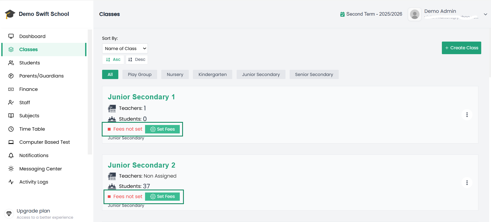
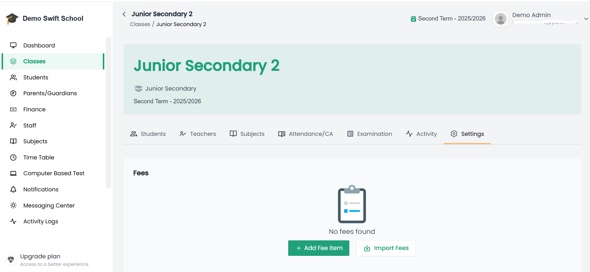
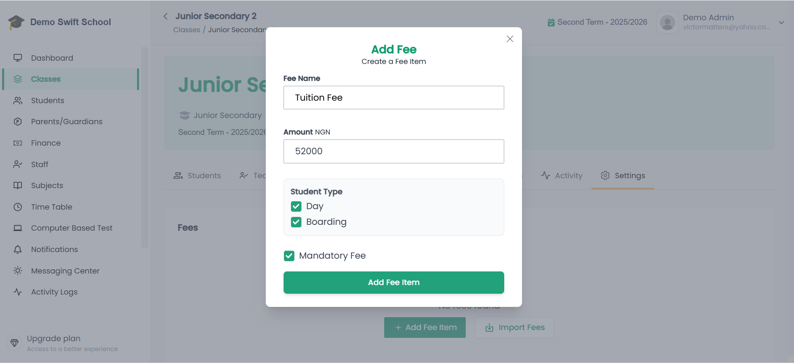
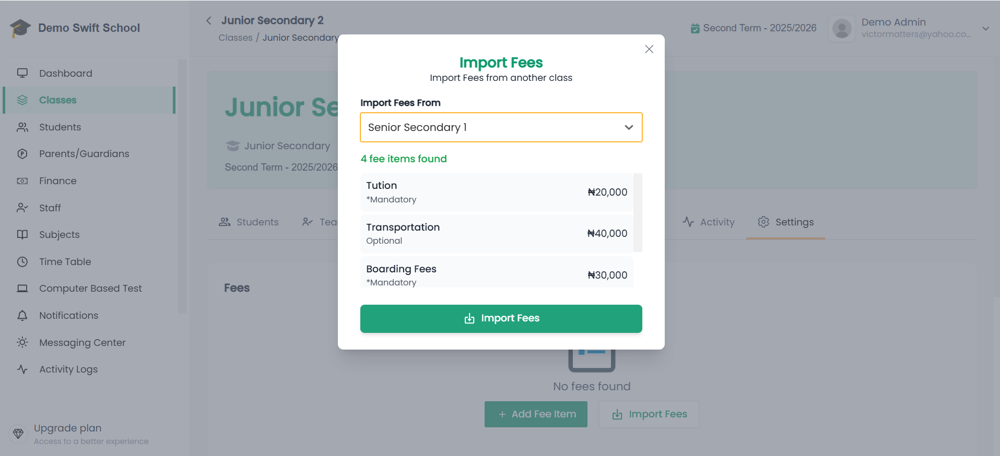

# 💰 Setup Class Fees

Every class in your school can have **specific fee items** (e.g., Tuition, Lab Fee, PTA Levy).  
This ensures that all students in that class are billed correctly and consistently.  

---

## Steps to Setup Class Fees

1. **Click on Classes** in the sidebar.  
   - This opens the **Classes list page** where all your school’s classes are displayed.  

📸 **Example of List of Classes with Fees Not Set Indicator:**  

---

2. From the list, click on the **class you want to set fees for**.  
   - This will open the **Class Details page**.  
   - If fees have never been set for this class, you will see an indicator **“Fees not set”** along with a **Set Fees** button.  
   - Clicking **Set Fees** will also take you straight into the **Settings tab** of that class.  

3. Inside the class, go to the **Settings** tab.  

📸 **Example of Class Settings Tab:**  

---

4. In the settings tab, locate the **Add Fee Item** button.  
   - Clicking it will open the **Add Fee Item Modal**.  

5. Fill in the fee item form:  
   - **Fee Name** → e.g., *Tuition Fee*, *Lab Fee*  
   - **Amount** → Enter the fee amount  
   - **Mandatory** → Check this if the fee must be paid by all students  
   - **Student Type** → *(Visible only if your school is registered as **Both Day & Boarding**)*  
     - Choose whether the fee should apply to **Day students**, **Boarding students**, or **both**  

📸 **Example of Add Fee Item Modal:**  

---

6. Click **Add Fee Item** to finish.  
   - Repeat this process for as many fee items as needed (e.g., *Tuition Fee*, *Lab Fee*, *Sports Levy*).  

---

7. Once fee items are added, you can:  
   - **Export Fees** → Copy all fee items from this class into another class.  
   - **Import Fees** → Bring in fee items from another class into this one (useful when many classes share the same fees).  

📸 **Example of Import/Export Buttons:**  
 

---

## ✅ Important Notes

- Fee items set at the class level automatically apply to **all students enrolled in that class**.  
- You can always edit or remove a fee item later if adjustments are needed.  
- Exporting and importing saves time when multiple classes share identical fee structures.  

---

🎉 You have successfully set fees for the class! After completing fees setup for all your classes next is to [Activate Fees](/docs/admin/classes/activate-fees).
