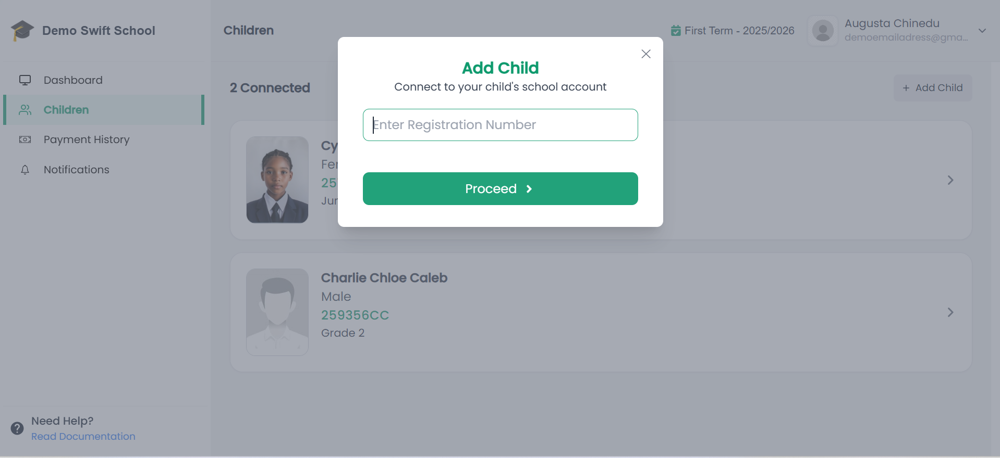
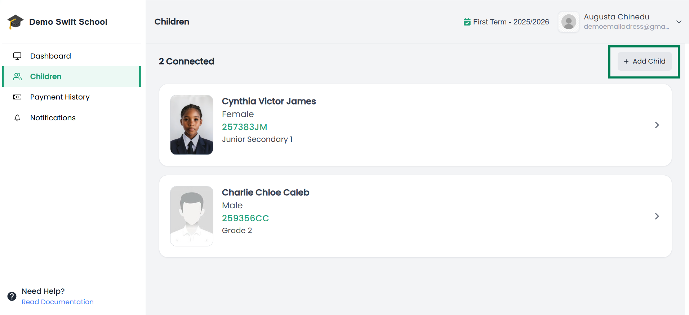
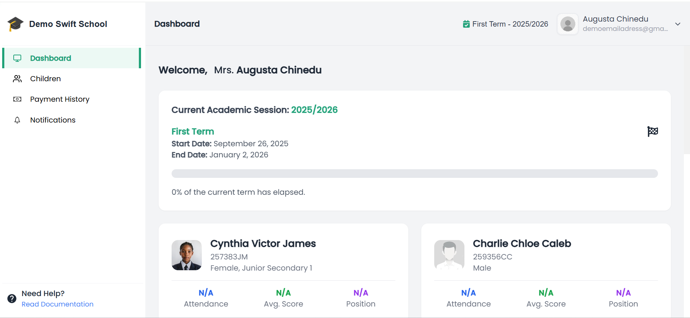

# 👨‍👩‍👦 Add Child to Parent Account

To view your child’s school records in the **Parent Portal**, you need to connect them to your account. This process is simple and requires only your child’s **Registration Number**.

---

## 📝 What You Need
- Your **child’s registration number**  
  👉 Get this from the school management or from any document already issued (e.g., admission slip, ID card, report card).

---

## 🚀 Steps to Add a Child

1. **Log in** to your Parent Portal.  
2. From the sidebar, go to **Children**.  
3. Click **Add Child**.  
4. Enter your child’s **registration number** in the pop-up modal.  

   📌 Example of Add Child Modal:  
     

5. Click **Save / Link Child**.  

✅ Your child will now appear in your Parent Dashboard.  

---

## 👨‍👩‍👧 Adding More Than One Child
- Repeat the same process for each child using their **unique registration number**.  
- All linked children will show under **Children** in your dashboard.  

📌 Example of Parent Dashboard with Multiple Children:  
  

---

## 📊 What You Can Do After Linking
Once connected, you can view:  
- Attendance records  
- Academic results  
- Assignments & homework  
- School announcements  

📌 Example of Parent Dashboard:  

