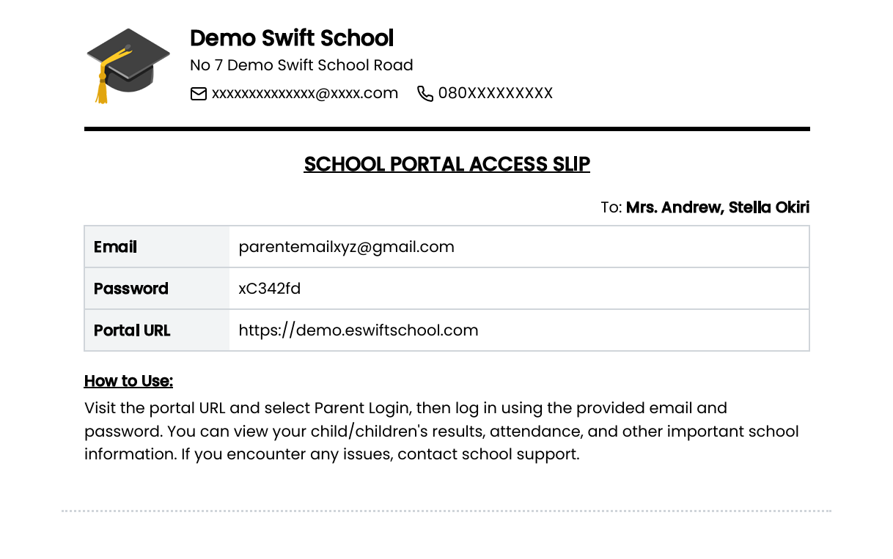
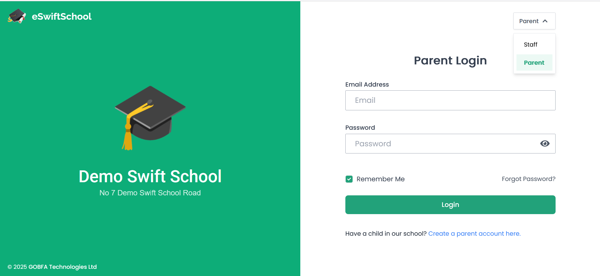
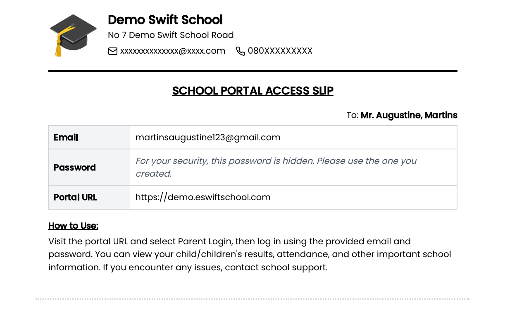

# Parent Portal Login Guide

The **Parent Portal** gives you secure access to your child’s school information — attendance, results, announcements, and more.  

---

## 🔑 How to Get Your Login Details

Your child’s school will provide you with a **Portal Access Slip** containing:  
- The **school’s unique web address** (e.g., `brightfuture.eswiftschool.com`)  
- Your **email address** (for login)  
- A **temporary password**  

📌 Example of a Parent Portal Access Slip:  

---

## 🌐 How to Log In

1. Go to your **child’s school portal** (e.g., `brightfuture.eswiftschool.com`).  
2. On the **top-right corner**, open the dropdown and select **Parent**.  
3. Enter your **email** and **password**.  
4. Click **Login**.  

📌 Example of the Parent Portal Login Page:  

---

## 🔒 Important: About Your Password  

Sometimes, instead of showing your password on the **access slip**, you may see a message like this:  

> **“For your security, this password is hidden. Please use the one you created.”**

This means:  
- You (the parent) **have already changed the default password** provided by the school, OR  
- You **created the parent account yourself** and set a password during registration.  

➡️ For security reasons, your private password cannot be shown again.  
➡️ Simply log in with the password you already created.  
➡️ If you have forgotten it, click **“Forgot Password”** on the login page to reset it.  

📌 Example of the Login Page with Hidden Password Notice:  

---

## 📊 Parent Dashboard  

Once logged in, you’ll arrive at your **child’s school dashboard**, which gives you access to:  
- Attendance records  
- Academic reports  
- Assignments  
- School announcements  

📌 Example of a Parent Dashboard:  

